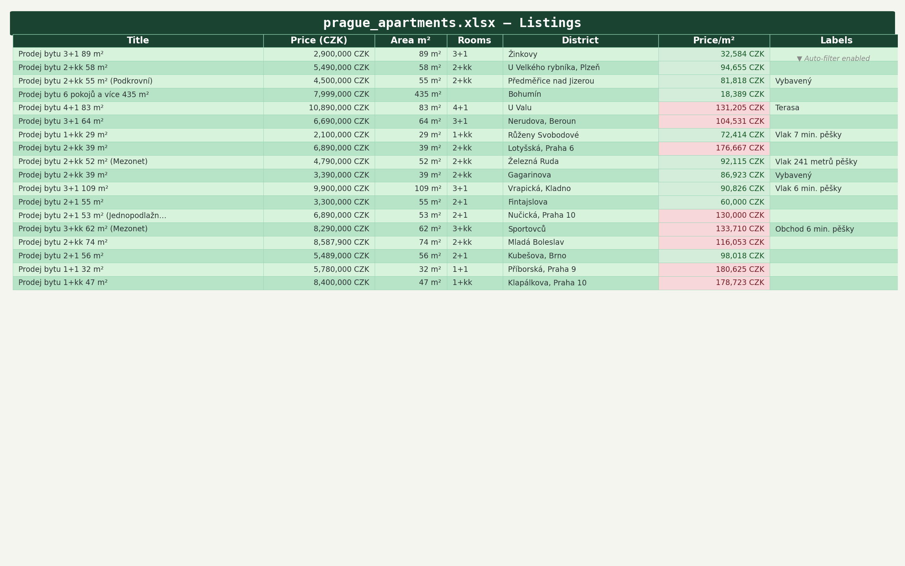
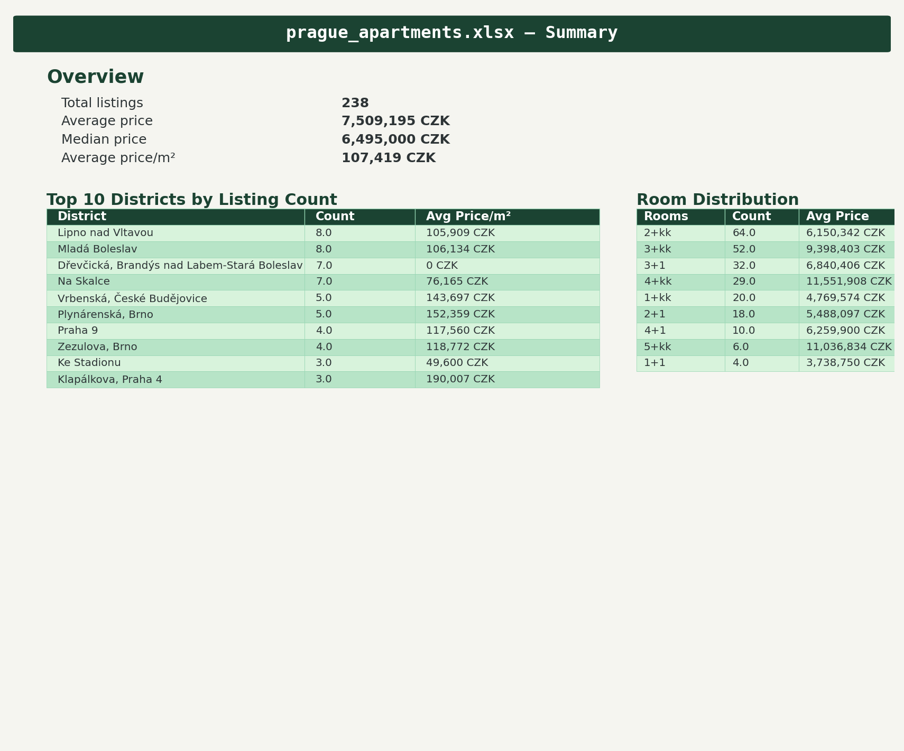
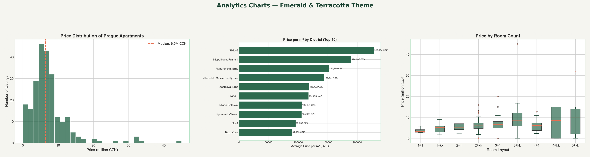

# Prague Real Estate Scraper — API → Clean Data → Styled Excel + Charts

ETL pipeline that pulls live apartment listings from the sreality.cz API, cleans them with pandas, and produces a styled Excel report plus a set of matplotlib charts — one command, end to end.

```
sreality.cz API ──> raw JSON ──> pandas cleaning ──> styled .xlsx ──> charts (.png)
```

## Output

**Excel report** (`output/prague_apartments.xlsx`) — listings sheet with price, size, price-per-m², district, and a summary sheet with market aggregates:





**Charts** — price distribution, price vs. size, district comparison:



## Run it

```bash
pip install -r requirements.txt
python main.py              # scrape fresh data (rate-limited, ~4 pages)
python main.py --use-cache  # re-run cleaning/export from saved raw JSON
```

## What the cleaning handles

- Prices arriving as strings with mixed formatting → numeric CZK
- Listing names parsed into layout (2+kk, 3+1, …) and size in m²
- Locality strings split into district / city
- Deduplication and dropping of listings with missing critical fields
- Derived metric: price per m²

## Stack & structure

- **Python 3.11+**, requests (API pagination with delays), pandas, openpyxl (styled export), matplotlib

```
main.py        pipeline: scrape → clean → export → visualize
scraper.py     sreality.cz API client, raw JSON caching
cleaner.py     pandas cleaning & feature derivation
exporter.py    styled Excel writer (listings + summary sheets)
visualize.py   chart generation
```

## Notes

Raw responses are cached to `data/raw_listings.json`, so the transform/export steps are re-runnable offline (`--use-cache`) — handy while iterating on cleaning logic without hammering the API.
